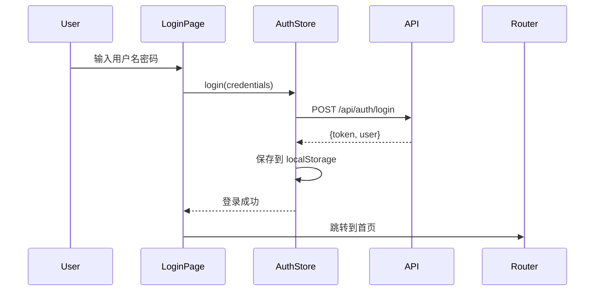
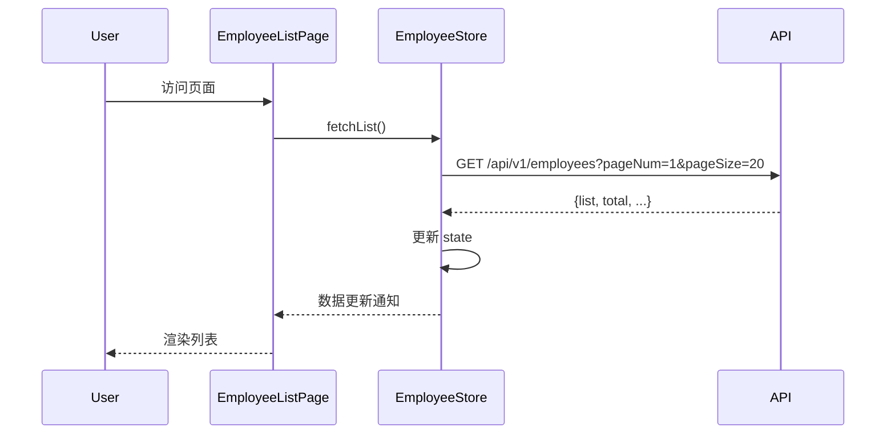
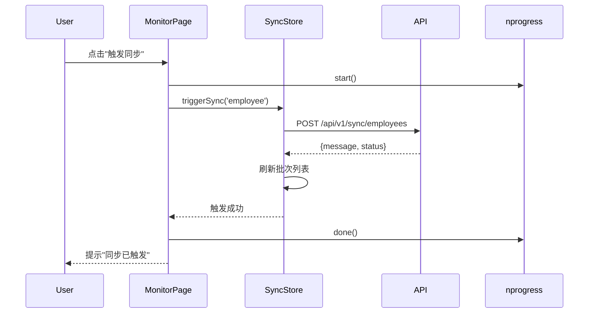

# 数据模型设计：数据分析平台

**版本:** 1.0  
**日期:** 2025-12-23  
**状态:** 已完成

---

## 目的

本文档定义数据分析平台前端的数据模型，包括状态管理（Pinia Store）、TypeScript 接口定义、数据流向和验证规则。

---

## 1. 核心数据实体

### 1.1 用户认证相关

#### User（用户信息）

```typescript
/**
 * 用户信息
 */
interface User {
  /** 用户ID */
  id: string
  /** 用户名 */
  username: string
  /** 姓名 */
  name: string
  /** 邮箱 */
  email: string
  /** 手机号 */
  phone?: string
  /** 角色列表 */
  roles: string[]
  /** 权限码列表 */
  permissions: string[]
  /** 头像URL */
  avatar?: string
  /** 创建时间 */
  createdAt: string
}
```

#### AuthToken（认证令牌）

```typescript
/**
 * 认证令牌
 */
interface AuthToken {
  /** 访问令牌 */
  accessToken: string
  /** 刷新令牌 */
  refreshToken: string
  /** 过期时间（秒） */
  expiresIn: number
  /** 令牌类型 */
  tokenType: 'Bearer'
}
```

#### LoginRequest（登录请求）

```typescript
/**
 * 登录请求
 */
interface LoginRequest {
  /** 用户名 */
  username: string
  /** 密码 */
  password: string
  /** 验证码（可选） */
  captcha?: string
}
```

**验证规则：**

- `username`: 必填，长度 3-20，只允许字母数字下划线
- `password`: 必填，长度 6-32
- `captcha`: 可选，长度 4-6

---

### 1.2 员工数据相关

#### Employee（员工信息）

```typescript
/**
 * 员工信息（对应 API 的 EmployeeVO）
 */
interface Employee {
  /** 员工内部ID */
  id: string
  /** 员工工号 */
  employeeNo: string
  /** 员工姓名 */
  name: string
  /** 邮箱地址 */
  email: string
  /** 手机号码 */
  phone: string
  /** 入职日期（ISO 8601格式） */
  employmentDate: string
  /** 在职状态 */
  employmentStatus: string
  /** 职务（字符串） */
  position: string
  /** 所属组织ID（可能为null） */
  organizationId: string | null
  /** 所属组织名称（可能为null） */
  organizationName: string | null
  /** 职务ID（可能为null） */
  jobPostId: string | null
  /** 职务名称（可能为null） */
  jobPostName: string | null
}
```

#### EmployeeFilters（员工筛选条件）

```typescript
/**
 * 员工列表筛选条件
 */
interface EmployeeFilters {
  /** 页码（从1开始） */
  pageNum: number
  /** 每页数量（1-100） */
  pageSize: number
  /** 搜索关键词（姓名模糊匹配） */
  keyword?: string
}
```

**验证规则：**

- `pageNum`: 必填，最小值 1
- `pageSize`: 必填，范围 1-100
- `keyword`: 可选，最大长度 50

#### EmployeeListResponse（员工列表响应）

```typescript
/**
 * 员工列表响应
 */
interface EmployeeListResponse {
  /** 员工列表 */
  list: Employee[]
  /** 当前页码 */
  pageNum: number
  /** 每页条数 */
  pageSize: number
  /** 总记录数 */
  total: number
  /** 总页数 */
  totalPages: number
}
```

---

### 1.3 组织架构相关

#### Organization（组织节点）

```typescript
/**
 * 组织树节点（对应 API 的 OrganizationTreeNodeVO）
 */
interface Organization {
  /** 组织ID */
  id: string
  /** 组织名称 */
  name: string
  /** 组织编码 */
  code: string
  /** 父组织ID（根节点为null） */
  parentId: string | null
  /** 组织层级 */
  level: number
  /** 子组织列表 */
  children: Organization[]
}
```

**说明：**

- 递归结构，支持无限层级
- `children` 为空数组表示叶子节点

---

### 1.4 职务数据相关

#### Position（职务信息）

```typescript
/**
 * 职务信息（对应 API 的 PositionVO）
 */
interface Position {
  /** 职务ID */
  id: string
  /** 职务名称 */
  name: string
  /** 职务编码 */
  code: string
}
```

#### PositionFilters（职务筛选条件）

```typescript
/**
 * 职务列表筛选条件
 */
interface PositionFilters {
  /** 页码（从1开始） */
  pageNum: number
  /** 每页数量（1-100） */
  pageSize: number
  /** 搜索关键词（职务名称模糊匹配） */
  keyword?: string
}
```

#### PositionListResponse（职务列表响应）

```typescript
/**
 * 职务列表响应
 */
interface PositionListResponse {
  /** 职务列表 */
  list: Position[]
  /** 当前页码 */
  pageNum: number
  /** 每页条数 */
  pageSize: number
  /** 总记录数 */
  total: number
  /** 总页数 */
  totalPages: number
}
```

---

### 1.5 同步任务相关

#### SyncBatch（同步批次）

```typescript
/**
 * 同步批次信息
 */
interface SyncBatch {
  /** 批次ID */
  id: string
  /** 批次ID（与id相同，兼容字段） */
  batchId: string
  /** 同步类型 */
  syncType: 'employee' | 'organization' | 'jobpost'
  /** 触发模式 */
  triggerMode: 'manual' | 'scheduled'
  /** 状态 */
  status: 'running' | 'success' | 'failed'
  /** 开始时间 */
  startTime: string
  /** 结束时间（running状态时为null） */
  endTime: string | null
  /** 持续时间（毫秒） */
  durationMs: number | null
  /** 总记录数 */
  totalCount: number
  /** 成功记录数 */
  successCount: number
  /** 失败记录数 */
  failedCount: number
  /** 错误摘要 */
  errorSummary: string
  /** 时间范围开始 */
  timeRangeStart: string | null
  /** 时间范围结束 */
  timeRangeEnd: string | null
  /** 父批次ID（用于关联顺序同步） */
  parentBatchId: string | null
  /** 创建时间 */
  createdAt: string
  /** 更新时间 */
  updatedAt: string
}
```

#### SyncBatchFilters（批次筛选条件）

```typescript
/**
 * 同步批次筛选条件
 */
interface SyncBatchFilters {
  /** 页码 */
  page: number
  /** 每页数量（最大100） */
  pageSize: number
  /** 同步类型 */
  syncType?: 'employee' | 'organization' | 'jobpost'
  /** 状态 */
  status?: 'running' | 'success' | 'failed'
  /** 开始时间（ISO 8601格式） */
  startTime?: string
  /** 结束时间（ISO 8601格式） */
  endTime?: string
}
```

#### SyncBatchListResponse（批次列表响应）

```typescript
/**
 * 同步批次列表响应
 */
interface SyncBatchListResponse {
  /** 批次列表 */
  batches: SyncBatch[]
  /** 分页信息 */
  pagination: {
    page: number
    pageSize: number
    totalCount: number
    totalPages: number
  }
}
```

#### SyncLog（同步日志）

```typescript
/**
 * 同步日志详情
 */
interface SyncLog {
  /** 日志ID */
  id: string
  /** 批次ID */
  batchId: string
  /** 记录类型 */
  recordType: string
  /** 记录标识符 */
  recordIdentifier: string
  /** 操作类型 */
  operation: 'insert' | 'update' | 'delete'
  /** 状态 */
  status: 'success' | 'failed'
  /** 错误信息 */
  errorMessage: string
  /** 错误代码 */
  errorCode: string
  /** 记录详情（JSON对象） */
  recordDetails: Record<string, any>
  /** 处理时间 */
  processedAt: string
  /** 创建时间 */
  createdAt: string
}
```

#### SyncTriggerRequest（同步触发请求）

```typescript
/**
 * 同步触发请求
 */
interface SyncTriggerRequest {
  /** 开始时间（可选，ISO 8601格式） */
  timeRangeStart?: string
  /** 结束时间（可选，ISO 8601格式） */
  timeRangeEnd?: string
}
```

#### OrderedFlowStatus（完整同步流程状态）

```typescript
/**
 * 完整顺序同步流程状态
 */
interface OrderedFlowStatus {
  latestOrderedSync: {
    /** 组织同步批次 */
    orgBatch: {
      batchId: string
      status: 'running' | 'success' | 'failed'
      startTime: string
      endTime: string | null
      durationMs: number | null
      totalCount: number
      successCount: number
      failedCount: number
    }
    /** 职务同步批次 */
    jobpostBatch: {
      batchId: string
      status: 'running' | 'success' | 'failed'
      startTime: string
      endTime: string | null
      durationMs: number | null
      totalCount: number
      successCount: number
      failedCount: number
    }
    /** 员工同步批次 */
    employeeBatch: {
      batchId: string
      status: 'running' | 'success' | 'failed'
      startTime: string
      endTime: string | null
      durationMs: number | null
      totalCount: number
      successCount: number
      failedCount: number
    }
    /** 总持续时间（毫秒） */
    totalDurationMs: number
    /** 整体状态 */
    overallStatus: 'running' | 'success' | 'failed'
  }
}
```

---

### 1.6 系统通用相关

#### UnifiedResponse（统一响应结构）

```typescript
/**
 * 统一响应结构（核心数据查询接口使用）
 */
interface UnifiedResponse<T = any> {
  /** 业务状态码（200=成功） */
  code: number
  /** 响应消息 */
  message: string
  /** 请求追踪ID */
  requestId: string
  /** 实际数据 */
  data: T
}
```

#### ApiError（API 错误）

```typescript
/**
 * API 错误
 */
interface ApiError {
  /** 错误消息 */
  error: string
  /** HTTP 状态码 */
  status: number
  /** 请求ID（如果有） */
  requestId?: string
}
```

#### MenuItem（菜单项）

```typescript
/**
 * 菜单项
 */
interface MenuItem {
  /** 菜单ID */
  id: string
  /** 菜单名称 */
  name: string
  /** 路由路径 */
  path: string
  /** 图标 */
  icon?: string
  /** 权限标识 */
  permission?: string
  /** 子菜单 */
  children?: MenuItem[]
  /** 是否隐藏 */
  hidden?: boolean
}
```

#### RouteMetaCustom（路由元信息）

```typescript
/**
 * 路由元信息（扩展 Vue Router 的 RouteMeta）
 */
interface RouteMetaCustom {
  /** 页面标题 */
  title: string
  /** 权限标识 */
  permission?: string
  /** 是否需要认证 */
  requiresAuth?: boolean
  /** 是否缓存 */
  keepAlive?: boolean
  /** 图标 */
  icon?: string
  /** 是否在菜单中隐藏 */
  hidden?: boolean
}
```

---

## 2. Pinia Store 设计

### 2.1 Auth Store（认证状态）

```typescript
// src/stores/auth.ts
import { defineStore } from 'pinia'

interface AuthState {
  /** 访问令牌 */
  token: string | null
  /** 刷新令牌 */
  refreshToken: string | null
  /** 用户信息 */
  userInfo: User | null
  /** 权限列表 */
  permissions: string[]
  /** 是否正在登录 */
  isLoggingIn: boolean
}

export const useAuthStore = defineStore('auth', {
  state: (): AuthState => ({
    token: localStorage.getItem('access_token'),
    refreshToken: localStorage.getItem('refresh_token'),
    userInfo: null,
    permissions: [],
    isLoggingIn: false,
  }),

  getters: {
    /** 是否已认证 */
    isAuthenticated: (state) => !!state.token,

    /** 检查是否有指定权限 */
    hasPermission: (state) => (permission: string) => {
      return state.permissions.includes(permission)
    },

    /** 检查是否有任一权限 */
    hasAnyPermission: (state) => (permissions: string[]) => {
      return permissions.some(p => state.permissions.includes(p))
    },

    /** 检查是否有所有权限 */
    hasAllPermissions: (state) => (permissions: string[]) => {
      return permissions.every(p => state.permissions.includes(p))
    },
  },

  actions: {
    /** 登录 */
    async login(loginData: LoginRequest) {
      this.isLoggingIn = true
      try {
        const response = await api.login(loginData)
        this.setAuth(response)
      } finally {
        this.isLoggingIn = false
      }
    },

    /** 设置认证信息 */
    setAuth(authData: { token: AuthToken; user: User }) {
      this.token = authData.token.accessToken
      this.refreshToken = authData.token.refreshToken
      this.userInfo = authData.user
      this.permissions = authData.user.permissions

      localStorage.setItem('access_token', authData.token.accessToken)
      localStorage.setItem('refresh_token', authData.token.refreshToken)
    },

    /** 登出 */
    logout() {
      this.token = null
      this.refreshToken = null
      this.userInfo = null
      this.permissions = []

      localStorage.removeItem('access_token')
      localStorage.removeItem('refresh_token')
    },

    /** 刷新用户信息 */
    async refreshUserInfo() {
      if (!this.isAuthenticated) return
      const userInfo = await api.getUserInfo()
      this.userInfo = userInfo
      this.permissions = userInfo.permissions
    },
  },
})
```

---

### 2.2 Employee Store（员工数据）

```typescript
// src/stores/employee.ts
import { defineStore } from 'pinia'

interface EmployeeState {
  /** 员工列表 */
  list: Employee[]
  /** 总记录数 */
  total: number
  /** 是否正在加载 */
  loading: boolean
  /** 筛选条件 */
  filters: EmployeeFilters
  /** 当前查看的员工详情 */
  currentEmployee: Employee | null
}

export const useEmployeeStore = defineStore('employee', {
  state: (): EmployeeState => ({
    list: [],
    total: 0,
    loading: false,
    filters: {
      pageNum: 1,
      pageSize: 20,
      keyword: '',
    },
    currentEmployee: null,
  }),

  getters: {
    /** 总页数 */
    totalPages: (state) => Math.ceil(state.total / state.filters.pageSize),

    /** 是否有数据 */
    hasData: (state) => state.list.length > 0,
  },

  actions: {
    /** 获取员工列表 */
    async fetchList(filters?: Partial<EmployeeFilters>) {
      if (filters) {
        this.filters = { ...this.filters, ...filters }
      }

      this.loading = true
      try {
        const response = await api.getEmployees(this.filters)
        this.list = response.list
        this.total = response.total
      } finally {
        this.loading = false
      }
    },

    /** 获取员工详情 */
    async fetchDetail(id: string) {
      this.loading = true
      try {
        this.currentEmployee = await api.getEmployeeDetail(id)
      } finally {
        this.loading = false
      }
    },

    /** 重置筛选条件 */
    resetFilters() {
      this.filters = {
        pageNum: 1,
        pageSize: 20,
        keyword: '',
      }
    },

    /** 设置页码 */
    setPage(page: number) {
      this.filters.pageNum = page
    },

    /** 设置每页数量 */
    setPageSize(size: number) {
      this.filters.pageSize = size
      this.filters.pageNum = 1 // 重置到第一页
    },

    /** 设置关键词 */
    setKeyword(keyword: string) {
      this.filters.keyword = keyword
      this.filters.pageNum = 1 // 重置到第一页
    },
  },
})
```

---

### 2.3 Organization Store（组织架构）

```typescript
// src/stores/organization.ts
import { defineStore } from 'pinia'

interface OrganizationState {
  /** 组织树 */
  tree: Organization[]
  /** 是否正在加载 */
  loading: boolean
  /** 扁平化的组织映射（id -> Organization） */
  organizationMap: Map<string, Organization>
}

export const useOrganizationStore = defineStore('organization', {
  state: (): OrganizationState => ({
    tree: [],
    loading: false,
    organizationMap: new Map(),
  }),

  getters: {
    /** 根据ID获取组织 */
    getOrganizationById: (state) => (id: string) => {
      return state.organizationMap.get(id)
    },

    /** 获取组织路径（面包屑） */
    getOrganizationPath: (state) => (id: string): Organization[] => {
      const path: Organization[] = []
      let current = state.organizationMap.get(id)

      while (current) {
        path.unshift(current)
        current = current.parentId ? state.organizationMap.get(current.parentId) : undefined
      }

      return path
    },
  },

  actions: {
    /** 获取组织树 */
    async fetchTree() {
      this.loading = true
      try {
        this.tree = await api.getOrganizationTree()
        this.buildOrganizationMap(this.tree)
      } finally {
        this.loading = false
      }
    },

    /** 构建组织映射（递归遍历树） */
    buildOrganizationMap(nodes: Organization[]) {
      this.organizationMap.clear()
      const traverse = (nodes: Organization[]) => {
        nodes.forEach(node => {
          this.organizationMap.set(node.id, node)
          if (node.children) {
            traverse(node.children)
          }
        })
      }
      traverse(nodes)
    },
  },
})
```

---

### 2.4 Position Store（职务数据）

```typescript
// src/stores/position.ts
import { defineStore } from 'pinia'

interface PositionState {
  /** 职务列表 */
  list: Position[]
  /** 总记录数 */
  total: number
  /** 是否正在加载 */
  loading: boolean
  /** 筛选条件 */
  filters: PositionFilters
}

export const usePositionStore = defineStore('position', {
  state: (): PositionState => ({
    list: [],
    total: 0,
    loading: false,
    filters: {
      pageNum: 1,
      pageSize: 20,
      keyword: '',
    },
  }),

  getters: {
    /** 总页数 */
    totalPages: (state) => Math.ceil(state.total / state.filters.pageSize),
  },

  actions: {
    /** 获取职务列表 */
    async fetchList(filters?: Partial<PositionFilters>) {
      if (filters) {
        this.filters = { ...this.filters, ...filters }
      }

      this.loading = true
      try {
        const response = await api.getPositions(this.filters)
        this.list = response.list
        this.total = response.total
      } finally {
        this.loading = false
      }
    },

    /** 重置筛选条件 */
    resetFilters() {
      this.filters = {
        pageNum: 1,
        pageSize: 20,
        keyword: '',
      }
    },
  },
})
```

---

### 2.5 Sync Store（同步任务监控）

```typescript
// src/stores/sync.ts
import { defineStore } from 'pinia'

interface SyncState {
  /** 批次列表 */
  batches: SyncBatch[]
  /** 分页信息 */
  pagination: {
    page: number
    pageSize: number
    totalCount: number
    totalPages: number
  }
  /** 筛选条件 */
  filters: SyncBatchFilters
  /** 当前批次详情 */
  currentBatch: SyncBatch | null
  /** 当前批次日志 */
  currentLogs: SyncLog[]
  /** 是否正在加载 */
  loading: boolean
  /** 完整同步流程状态 */
  orderedFlowStatus: OrderedFlowStatus | null
}

export const useSyncStore = defineStore('sync', {
  state: (): SyncState => ({
    batches: [],
    pagination: {
      page: 1,
      pageSize: 10,
      totalCount: 0,
      totalPages: 0,
    },
    filters: {
      page: 1,
      pageSize: 10,
    },
    currentBatch: null,
    currentLogs: [],
    loading: false,
    orderedFlowStatus: null,
  }),

  getters: {
    /** 是否有正在运行的批次 */
    hasRunningBatch: (state) => {
      return state.batches.some(batch => batch.status === 'running')
    },
  },

  actions: {
    /** 获取批次列表 */
    async fetchBatches(filters?: Partial<SyncBatchFilters>) {
      if (filters) {
        this.filters = { ...this.filters, ...filters }
      }

      this.loading = true
      try {
        const response = await api.getSyncBatches(this.filters)
        this.batches = response.batches
        this.pagination = response.pagination
      } finally {
        this.loading = false
      }
    },

    /** 获取批次详情 */
    async fetchBatchDetail(batchId: string) {
      this.loading = true
      try {
        this.currentBatch = await api.getSyncBatchDetail(batchId)
      } finally {
        this.loading = false
      }
    },

    /** 获取批次日志 */
    async fetchBatchLogs(batchId: string) {
      this.loading = true
      try {
        const response = await api.getSyncBatchLogs(batchId)
        this.currentLogs = response.logs
      } finally {
        this.loading = false
      }
    },

    /** 触发同步 */
    async triggerSync(
      syncType: 'employee' | 'organization' | 'jobpost',
      request?: SyncTriggerRequest
    ) {
      await api.triggerSync(syncType, request)
      // 触发后重新获取列表
      await this.fetchBatches()
    },

    /** 触发完整顺序同步 */
    async triggerOrderedSync() {
      await api.triggerOrderedSync()
      await this.fetchBatches()
    },

    /** 获取完整同步流程状态 */
    async fetchOrderedFlowStatus(batchId: string) {
      this.loading = true
      try {
        this.orderedFlowStatus = await api.getOrderedFlowStatus(batchId)
      } finally {
        this.loading = false
      }
    },
  },
})
```

---

### 2.6 App Store（全局应用状态）

```typescript
// src/stores/app.ts
import { defineStore } from 'pinia'

interface AppState {
  /** 主题模式 */
  theme: 'light' | 'dark'
  /** 侧边栏是否折叠 */
  sidebarCollapsed: boolean
  /** 菜单列表 */
  menuList: MenuItem[]
  /** 面包屑导航 */
  breadcrumbs: { name: string; path: string }[]
}

export const useAppStore = defineStore('app', {
  state: (): AppState => ({
    theme: (localStorage.getItem('theme') as 'light' | 'dark') || 'light',
    sidebarCollapsed: localStorage.getItem('sidebar_collapsed') === 'true',
    menuList: [],
    breadcrumbs: [],
  }),

  actions: {
    /** 切换主题 */
    toggleTheme() {
      this.theme = this.theme === 'light' ? 'dark' : 'light'
      document.documentElement.setAttribute('data-theme', this.theme)
      localStorage.setItem('theme', this.theme)
    },

    /** 切换侧边栏 */
    toggleSidebar() {
      this.sidebarCollapsed = !this.sidebarCollapsed
      localStorage.setItem('sidebar_collapsed', String(this.sidebarCollapsed))
    },

    /** 设置菜单列表 */
    setMenuList(menus: MenuItem[]) {
      this.menuList = menus
    },

    /** 设置面包屑 */
    setBreadcrumbs(breadcrumbs: { name: string; path: string }[]) {
      this.breadcrumbs = breadcrumbs
    },
  },
})
```

---

## 3. 数据流向

### 3.1 认证流程



### 3.2 员工列表查询流程



### 3.3 同步任务触发流程



---

## 4. 数据验证规则

### 4.1 表单验证

所有表单使用 Element Plus 的验证规则：

```typescript
// src/utils/validation.ts

/** 用户名验证规则 */
export const usernameRules = [
  { required: true, message: '请输入用户名', trigger: 'blur' },
  { min: 3, max: 20, message: '长度在 3 到 20 个字符', trigger: 'blur' },
  { pattern: /^[a-zA-Z0-9_]+$/, message: '只允许字母、数字和下划线', trigger: 'blur' },
]

/** 密码验证规则 */
export const passwordRules = [
  { required: true, message: '请输入密码', trigger: 'blur' },
  { min: 6, max: 32, message: '长度在 6 到 32 个字符', trigger: 'blur' },
]

/** 关键词验证规则 */
export const keywordRules = [
  { max: 50, message: '关键词长度不能超过 50 个字符', trigger: 'blur' },
]

/** 页码验证 */
export const validatePageNum = (value: number): boolean => {
  return Number.isInteger(value) && value >= 1
}

/** 每页数量验证 */
export const validatePageSize = (value: number): boolean => {
  return Number.isInteger(value) && value >= 1 && value <= 100
}
```

### 4.2 数据转换

```typescript
// src/utils/transform.ts

/** 格式化日期时间 */
export const formatDateTime = (isoString: string): string => {
  return new Date(isoString).toLocaleString('zh-CN')
}

/** 格式化持续时间 */
export const formatDuration = (ms: number): string => {
  if (ms < 1000) return `${ms}ms`
  if (ms < 60000) return `${(ms / 1000).toFixed(2)}s`
  return `${(ms / 60000).toFixed(2)}min`
}

/** 同步类型显示名称 */
export const getSyncTypeLabel = (type: string): string => {
  const labels: Record<string, string> = {
    employee: '员工同步',
    organization: '组织同步',
    jobpost: '职务同步',
  }
  return labels[type] || type
}

/** 状态显示名称 */
export const getStatusLabel = (status: string): string => {
  const labels: Record<string, string> = {
    running: '运行中',
    success: '成功',
    failed: '失败',
  }
  return labels[status] || status
}

/** 状态标签类型（Element Plus Tag） */
export const getStatusType = (status: string): 'info' | 'success' | 'danger' => {
  const types: Record<string, 'info' | 'success' | 'danger'> = {
    running: 'info',
    success: 'success',
    failed: 'danger',
  }
  return types[status] || 'info'
}
```

---

## 5. 数据持久化

### 5.1 LocalStorage 存储

| 键名                | 类型              | 说明           |
| ------------------- | ----------------- | -------------- |
| `access_token`      | string            | 访问令牌       |
| `refresh_token`     | string            | 刷新令牌       |
| `theme`             | 'light' \| 'dark' | 主题模式       |
| `sidebar_collapsed` | 'true' \| 'false' | 侧边栏折叠状态 |

### 5.2 SessionStorage 存储

| 键名            | 类型   | 说明                         |
| --------------- | ------ | ---------------------------- |
| `temp_redirect` | string | 临时重定向路径（登录后跳转） |

---

## 6. TypeScript 类型导出

所有类型定义统一导出：

```typescript
// src/types/index.ts
export type * from './auth'
export type * from './employee'
export type * from './organization'
export type * from './position'
export type * from './sync'
export type * from './common'
```

---

## 总结

本文档定义了数据分析平台前端的完整数据模型，包括：

1. ✅ **6 大核心实体**：用户认证、员工、组织、职务、同步任务、系统通用
2. ✅ **6 个 Pinia Store**：auth、employee、organization、position、sync、app
3. ✅ **数据流向图**：认证、查询、同步等流程
4. ✅ **验证规则**：表单验证和数据转换
5. ✅ **持久化策略**：LocalStorage 和 SessionStorage

所有类型定义遵循 TypeScript Strict Mode，确保类型安全。

---

**下一步：生成 API 契约文档和快速入门指南。**
