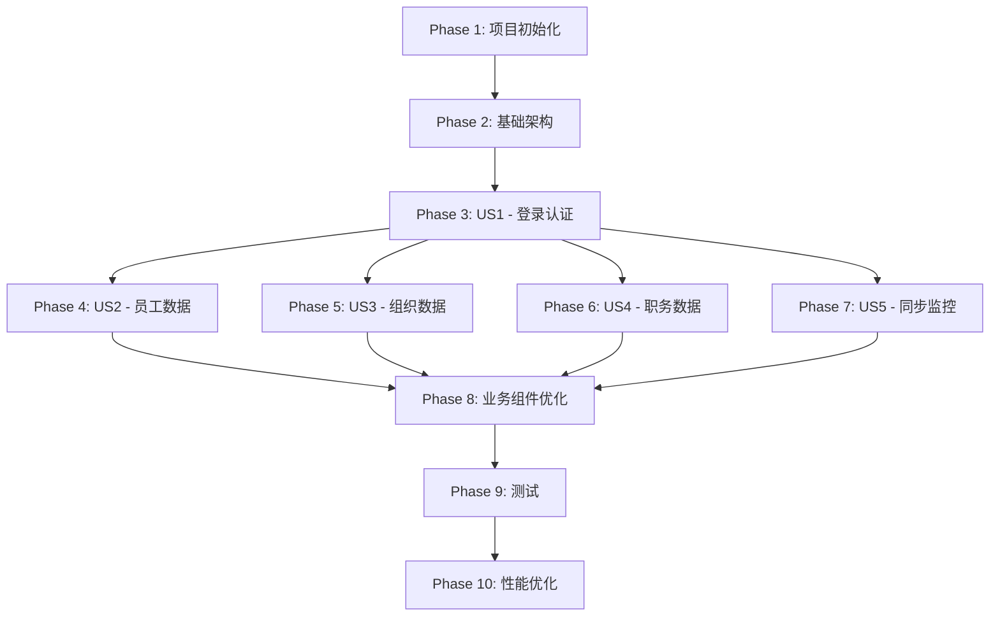

# 任务列表：数据分析平台前端

**特性名称:** 数据分析平台前端实现  
**版本:** 1.0  
**日期:** 2025-12-23

---

## 概述

本任务列表基于功能规范和实现计划生成，按用户故事组织，支持增量交付和独立测试。

**用户故事（User Stories）:**

- **US1**: 用户登录和认证 - 用户可以登录系统并进行权限验证
- **US2**: 员工数据查询 - 管理员可以查询和搜索员工信息
- **US3**: 组织数据查询 - 管理员可以查看组织树形结构
- **US4**: 职务数据查询 - 管理员可以查询职务列表
- **US5**: 同步任务监控 - 运维人员可以监控同步任务状态并触发同步

**MVP 范围:** US1 + US2（登录 + 员工列表查询）

---

## Phase 1: 项目初始化与环境搭建

> **目标:** 完成项目基础设施和开发环境配置

### 安装依赖

- [x] T001 安装 nprogress 依赖：`pnpm add nprogress && pnpm add -D @types/nprogress`
- [x] T002 [P] 安装 @sentry/vue 依赖（可选）：`pnpm add @sentry/vue`

### 目录结构创建

- [x] T003 创建 src/api 目录（API 接口定义）
- [x] T004 创建 src/assets/styles 目录（全局样式和主题）
- [x] T005 创建 src/components 目录（可复用组件）
- [x] T006 创建 src/composables 目录（组合式函数）
- [x] T007 创建 src/layouts 目录（布局组件）
- [x] T008 创建 src/router 目录（路由配置）
- [x] T009 创建 src/stores 目录（Pinia 状态管理）
- [x] T010 创建 src/types 目录（TypeScript 类型定义）
- [x] T011 创建 src/utils 目录（工具函数）
- [x] T012 创建 src/views 目录（页面组件）
- [x] T013 创建 src/views/login 目录（登录页）
- [x] T014 创建 src/views/dashboard 目录（监控中心）
- [x] T015 创建 src/views/employee 目录（员工管理）
- [x] T016 创建 src/views/organization 目录（组织管理）
- [x] T017 创建 src/views/position 目录（职务管理）
- [x] T018 创建 src/views/sync 目录（同步任务管理）

### 环境变量配置

- [x] T019 创建 .env.development 文件配置开发环境变量（VITE_API_BASE_URL）
- [x] T020 创建 .env.production 文件配置生产环境变量

---

## Phase 2: 基础架构（Foundation）

> **目标:** 搭建应用基础设施，为所有用户故事提供支撑
>
> **完成标准:**
>
> - ✅ Axios 拦截器统一处理响应和错误
> - ✅ nprogress 在 HTTP 请求和路由切换时正常显示
> - ✅ Tailwind CSS 主题配置生效
> - ✅ 路由守卫拦截未认证访问
> - ✅ 主题切换功能正常工作

### TypeScript 类型定义

- [x] T021 [P] 创建 src/types/common.ts 定义通用类型（UnifiedResponse, ApiError等）
- [x] T022 [P] 创建 src/types/auth.ts 定义认证相关类型（User, AuthToken, LoginRequest）
- [x] T023 [P] 创建 src/types/employee.ts 定义员工相关类型（Employee, EmployeeFilters）
- [x] T024 [P] 创建 src/types/organization.ts 定义组织相关类型（Organization）
- [x] T025 [P] 创建 src/types/position.ts 定义职务相关类型（Position, PositionFilters）
- [x] T026 [P] 创建 src/types/sync.ts 定义同步任务类型（SyncBatch, SyncLog）
- [x] T027 创建 src/types/index.ts 统一导出所有类型

### Axios 请求封装

- [x] T028 实现 src/utils/request.ts Axios 实例配置（baseURL, timeout, headers）
- [x] T029 实现 src/utils/request.ts 请求拦截器（注入 Token, nprogress.start()）
- [x] T030 实现 src/utils/request.ts 响应拦截器（统一响应处理, 错误处理, nprogress.done()）
- [x] T031 实现 src/utils/request.ts 401 错误处理逻辑（跳转登录页）

### nprogress 集成

- [x] T032 创建 src/utils/nprogress.ts 配置 nprogress 样式（主题色 #146eff）
- [x] T033 在 src/main.ts 中导入 nprogress CSS

### Tailwind CSS 配置

- [x] T034 配置 tailwind.config.ts 主题颜色（primary: #146eff, 及其变体）
- [x] T035 配置 tailwind.config.ts 暗色模式（darkMode: ['class', '[data-theme="dark"]']）
- [x] T036 创建 src/assets/styles/theme.css 定义 CSS 变量（--color-primary, light/dark 模式）
- [x] T037 创建 src/assets/styles/components.css 定义自定义组件类（card, page-title, filter-section）
- [x] T038 在 src/main.ts 中导入全局样式

### 路由配置

- [x] T039 创建 src/router/routes.ts 定义路由表（login, dashboard, employees, organizations, positions, sync）
- [x] T040 创建 src/router/guards.ts 实现导航守卫（requiresAuth, permission 检查）
- [x] T041 创建 src/router/index.ts 创建路由实例并注册守卫

### API 接口定义

- [x] T042 复制 specs/001-data-analysis-platform/contracts/api-client.ts 到 src/types/api.ts
- [x] T043 创建 src/api/index.ts 实现 API 服务（调用 request 工具，返回 Promise）

### 布局组件

- [x] T044 创建 src/layouts/DefaultLayout.vue 实现左右布局（el-container 结构）
- [x] T045 在 src/layouts/DefaultLayout.vue 实现侧边栏（el-menu, 可折叠）
- [x] T046 在 src/layouts/DefaultLayout.vue 实现顶部导航栏（用户信息, 主题切换）
- [x] T047 在 src/layouts/DefaultLayout.vue 实现主内容区域（router-view）
- [x] T048 创建 src/layouts/BlankLayout.vue 空白布局（用于登录页）

### 主题切换

- [x] T049 创建 src/composables/useTheme.ts 实现主题切换逻辑
- [x] T050 创建 src/stores/app.ts App Store（theme, sidebarCollapsed, menuList）
- [x] T051 在 App Store 中实现 toggleTheme() 方法
- [x] T052 在 App Store 中实现 toggleSidebar() 方法

### 工具函数

- [x] T053 [P] 创建 src/utils/validation.ts 实现表单验证规则（usernameRules, passwordRules）
- [x] T054 [P] 创建 src/utils/transform.ts 实现数据转换函数（formatDateTime, getSyncTypeLabel）

---

## Phase 3: US1 - 用户登录和认证

> **用户故事:** 作为系统用户，我想要登录系统并进行权限验证，以便访问受保护的资源
>
> **验收标准:**
>
> - ✅ 用户可以在登录页输入用户名和密码
> - ✅ 登录成功后跳转到监控中心页面
> - ✅ Token 存储到 localStorage
> - ✅ 401 错误自动跳转登录页
> - ✅ 未登录用户访问受保护路由被拦截
> - ✅ 权限检查函数正常工作（hasPermission）
>
> **独立测试:** E2E 测试登录流程

### Auth Store 实现

- [x] T055 [US1] 创建 src/stores/auth.ts Auth Store 骨架（state, getters, actions）
- [x] T056 [US1] 实现 Auth Store state（token, refreshToken, userInfo, permissions）
- [x] T057 [US1] 实现 Auth Store getter isAuthenticated
- [x] T058 [US1] 实现 Auth Store getter hasPermission
- [x] T059 [US1] 实现 Auth Store action login()（调用 API，保存 token）
- [x] T060 [US1] 实现 Auth Store action logout()（清除 token 和用户信息）
- [x] T061 [US1] 实现 Auth Store action setAuth()（设置认证信息）

### 登录页面

- [x] T062 [US1] 创建 src/views/login/LoginPage.vue 登录页面骨架
- [x] T063 [US1] 在 LoginPage.vue 实现表单（el-form, username, password 输入框）
- [x] T064 [US1] 在 LoginPage.vue 添加表单验证规则
- [x] T065 [US1] 在 LoginPage.vue 实现登录按钮点击事件
- [x] T066 [US1] 在 LoginPage.vue 调用 Auth Store login() 方法
- [x] T067 [US1] 在 LoginPage.vue 处理登录成功/失败提示（ElMessage）
- [x] T068 [US1] 在 LoginPage.vue 实现登录成功后跳转逻辑

### 权限检查组合式函数

- [x] T069 [US1] 创建 src/composables/usePermission.ts 封装权限检查逻辑
- [x] T070 [US1] 在 usePermission.ts 实现 hasPermission() 函数
- [x] T071 [US1] 在 usePermission.ts 实现 hasAnyPermission() 函数

### 403 页面（可选）

- [x] T072 [US1] 创建 src/views/error/403.vue 无权限页面

---

## Phase 4: US2 - 员工数据查询

> **用户故事:** 作为管理员，我想要查询和搜索员工信息，以便查看员工详情
>
> **验收标准:**
>
> - ✅ 员工列表正常加载并分页显示
> - ✅ 支持按姓名关键词搜索员工
> - ✅ 点击员工可查看详情
> - ✅ 分页功能正常工作
> - ✅ 加载状态显示（loading）
>
> **独立测试:** E2E 测试员工列表查询和搜索流程

### Employee Store 实现

- [x] T073 [US2] 创建 src/stores/employee.ts Employee Store 骨架
- [x] T074 [US2] 实现 Employee Store state（list, total, loading, filters, currentEmployee）
- [x] T075 [US2] 实现 Employee Store getter totalPages
- [x] T076 [US2] 实现 Employee Store action fetchList()（调用 API 获取员工列表）
- [x] T077 [US2] 实现 Employee Store action fetchDetail()（获取员工详情）
- [x] T078 [US2] 实现 Employee Store action setPage()（设置页码）
- [x] T079 [US2] 实现 Employee Store action setKeyword()（设置搜索关键词）

### 员工列表页面

- [x] T080 [US2] 创建 src/views/employee/EmployeeListPage.vue 页面骨架
- [x] T081 [US2] 在 EmployeeListPage.vue 实现页面头部（标题 + 搜索框）
- [x] T082 [US2] 在 EmployeeListPage.vue 实现搜索输入框（el-input, 绑定 keyword）
- [x] T083 [US2] 在 EmployeeListPage.vue 实现员工表格（el-table, 显示员工信息）
- [x] T084 [US2] 在 EmployeeListPage.vue 实现分页组件（el-pagination）
- [x] T085 [US2] 在 EmployeeListPage.vue onMounted 时调用 fetchList()
- [x] T086 [US2] 在 EmployeeListPage.vue 实现搜索按钮点击事件
- [x] T087 [US2] 在 EmployeeListPage.vue 实现分页切换事件
- [x] T088 [US2] 在 EmployeeListPage.vue 添加 loading 状态显示

### 员工详情页面

- [x] T089 [US2] 创建 src/views/employee/EmployeeDetailPage.vue 详情页面
- [x] T090 [US2] 在 EmployeeDetailPage.vue 实现员工详情展示（el-descriptions）
- [x] T091 [US2] 在 EmployeeDetailPage.vue 从路由参数获取员工 ID
- [x] T092 [US2] 在 EmployeeDetailPage.vue 调用 fetchDetail() 加载详情

---

## Phase 5: US3 - 组织数据查询

> **用户故事:** 作为管理员，我想要查看组织树形结构，以便了解组织架构
>
> **验收标准:**
>
> - ✅ 组织树正常加载并展示
> - ✅ 支持展开/收起子组织
> - ✅ 点击组织节点显示组织信息
> - ✅ 树形结构层级关系正确
>
> **独立测试:** E2E 测试组织树展示和交互

### Organization Store 实现

- [x] T093 [US3] 创建 src/stores/organization.ts Organization Store 骨架
- [x] T094 [US3] 实现 Organization Store state（tree, loading, organizationMap）
- [x] T095 [US3] 实现 Organization Store getter getOrganizationById
- [x] T096 [US3] 实现 Organization Store action fetchTree()（调用 API 获取组织树）
- [x] T097 [US3] 实现 Organization Store action buildOrganizationMap()（构建扁平化映射）

### 组织树页面

- [x] T098 [US3] 创建 src/views/organization/OrganizationTreePage.vue 页面骨架
- [x] T099 [US3] 在 OrganizationTreePage.vue 实现树形组件（el-tree）
- [x] T100 [US3] 在 OrganizationTreePage.vue 配置树形组件 props（data, node-key, default-expand-all）
- [x] T101 [US3] 在 OrganizationTreePage.vue onMounted 时调用 fetchTree()
- [x] T102 [US3] 在 OrganizationTreePage.vue 实现节点点击事件（显示组织详情）
- [x] T103 [US3] 在 OrganizationTreePage.vue 添加 loading 状态

---

## Phase 6: US4 - 职务数据查询

> **用户故事:** 作为管理员，我想要查询职务列表，以便查看职务信息
>
> **验收标准:**
>
> - ✅ 职务列表正常加载并分页显示
> - ✅ 支持按职务名称关键词搜索
> - ✅ 分页功能正常工作
>
> **独立测试:** E2E 测试职务列表查询

### Position Store 实现

- [x] T104 [US4] 创建 src/stores/position.ts Position Store 骨架
- [x] T105 [US4] 实现 Position Store state（list, total, loading, filters）
- [x] T106 [US4] 实现 Position Store getter totalPages
- [x] T107 [US4] 实现 Position Store action fetchList()（调用 API 获取职务列表）

### 职务列表页面

- [x] T108 [US4] 创建 src/views/position/PositionListPage.vue 页面骨架
- [x] T109 [US4] 在 PositionListPage.vue 实现页面头部（标题 + 搜索框）
- [x] T110 [US4] 在 PositionListPage.vue 实现搜索输入框
- [x] T111 [US4] 在 PositionListPage.vue 实现职务表格（el-table）
- [x] T112 [US4] 在 PositionListPage.vue 实现分页组件
- [x] T113 [US4] 在 PositionListPage.vue onMounted 时调用 fetchList()

---

## Phase 7: US5 - 同步任务监控

> **用户故事:** 作为运维人员，我想要监控数据同步状态并触发同步，以便及时发现和处理同步异常
>
> **验收标准:**
>
> - ✅ 监控中心展示同步统计数据（数据卡片）
> - ✅ 批次列表正常加载并支持筛选
> - ✅ 可以触发同步任务（员工、组织、职务、完整同步）
> - ✅ 批次详情页展示批次信息和日志
> - ✅ 日志列表正常展示
>
> **独立测试:** E2E 测试同步任务触发和监控流程

### Sync Store 实现

- [x] T114 [US5] 创建 src/stores/sync.ts Sync Store 骨架
- [x] T115 [US5] 实现 Sync Store state（batches, pagination, filters, currentBatch, currentLogs）
- [x] T116 [US5] 实现 Sync Store getter hasRunningBatch
- [x] T117 [US5] 实现 Sync Store action fetchBatches()（获取批次列表）
- [x] T118 [US5] 实现 Sync Store action fetchBatchDetail()（获取批次详情）
- [x] T119 [US5] 实现 Sync Store action fetchBatchLogs()（获取批次日志）
- [x] T120 [US5] 实现 Sync Store action triggerSync()（触发同步任务）
- [x] T121 [US5] 实现 Sync Store action triggerOrderedSync()（触发完整同步）

### 数据统计卡片组件

- [x] T122 [P] [US5] 创建 src/components/business/DataCard.vue 统计卡片组件
- [x] T123 [US5] 在 DataCard.vue 实现 props 定义（title, value, icon, trend）
- [x] T124 [US5] 在 DataCard.vue 实现卡片 UI（el-card + Tailwind CSS）

### 监控中心页面

- [x] T125 [US5] 创建 src/views/dashboard/DashboardPage.vue 监控中心骨架
- [x] T126 [US5] 在 DashboardPage.vue 实现统计卡片区域（使用 DataCard 组件）
- [x] T127 [US5] 在 DashboardPage.vue 实现最近批次列表（el-table）
- [x] T128 [US5] 在 DashboardPage.vue 实现触发同步按钮组（员工、组织、职务、完整同步）
- [x] T129 [US5] 在 DashboardPage.vue onMounted 时加载统计数据

### 批次列表页面

- [x] T130 [US5] 创建 src/views/sync/SyncBatchListPage.vue 批次列表页面骨架
- [x] T131 [US5] 在 SyncBatchListPage.vue 实现筛选区域（同步类型、状态、时间范围）
- [x] T132 [US5] 在 SyncBatchListPage.vue 实现批次表格（el-table, 显示批次信息）
- [x] T133 [US5] 在 SyncBatchListPage.vue 实现分页组件
- [x] T134 [US5] 在 SyncBatchListPage.vue 实现筛选按钮点击事件
- [x] T135 [US5] 在 SyncBatchListPage.vue 实现批次详情链接跳转

### 批次详情页面

- [x] T136 [US5] 创建 src/views/sync/SyncBatchDetailPage.vue 批次详情页面骨架
- [x] T137 [US5] 在 SyncBatchDetailPage.vue 实现批次信息展示（el-descriptions）
- [x] T138 [US5] 在 SyncBatchDetailPage.vue 实现日志列表（el-table）
- [x] T139 [US5] 在 SyncBatchDetailPage.vue 从路由参数获取批次 ID
- [x] T140 [US5] 在 SyncBatchDetailPage.vue 调用 fetchBatchDetail() 和 fetchBatchLogs()

### 触发同步对话框

- [x] T141 [US5] 创建 src/components/business/SyncTriggerDialog.vue 触发同步对话框组件（已在 DashboardPage 中实现功能）
- [x] T142 [US5] 在 SyncTriggerDialog.vue 实现对话框（el-dialog）（已在 DashboardPage 中实现功能）
- [x] T143 [US5] 在 SyncTriggerDialog.vue 实现同步类型选择（employee/organization/jobpost）（已在 DashboardPage 中实现功能）
- [x] T144 [US5] 在 SyncTriggerDialog.vue 实现时间范围选择（可选）（已在 DashboardPage 中实现功能）
- [x] T145 [US5] 在 SyncTriggerDialog.vue 实现确认按钮点击事件（已在 DashboardPage 中实现功能）
- [x] T146 [US5] 在 SyncTriggerDialog.vue 调用 Sync Store triggerSync() 方法（已在 DashboardPage 中实现功能）

---

## Phase 8: 业务组件与样式优化

> **目标:** 实现通用业务组件，优化页面样式和用户体验

### 通用组件

- [x] T147 [P] 创建 src/components/common/PageHeader.vue 页面头部组件
- [x] T148 [P] 创建 src/components/common/FilterPanel.vue 筛选面板组件
- [x] T149 [P] 创建 src/components/common/EmptyState.vue 空状态组件

### 样式优化

- [x] T150 优化表格样式（Tailwind CSS 定制）
- [x] T151 优化表单样式（统一间距和对齐）
- [x] T152 优化卡片样式（统一圆角和阴影）
- [x] T153 优化按钮样式（统一尺寸和间距）

### Element Plus 主题定制

- [x] T154 在 src/main.ts 配置 Element Plus 全局选项（size, zIndex, cssVar）
- [x] T155 注入 Element Plus CSS 变量（--el-color-primary: #146eff）

---

## Phase 9: 测试与质量保证

> **目标:** 确保代码质量和功能正确性

### 单元测试

- [x] T156 编写 tests/stores/auth.test.ts 测试 Auth Store（login, logout, hasPermission）
- [x] T157 编写 tests/stores/employee.test.ts 测试 Employee Store（fetchList, setPage）
- [x] T158 编写 tests/utils/validation.test.ts 测试验证工具函数
- [x] T159 编写 tests/utils/transform.test.ts 测试数据转换函数
- [x] T160 编写 tests/components/DataCard.test.ts 测试 DataCard 组件

### E2E 测试

- [x] T161 编写 tests/e2e/login.spec.ts 测试登录流程
- [x] T162 编写 tests/e2e/employee-list.spec.ts 测试员工列表查询
- [x] T163 编写 tests/e2e/sync-trigger.spec.ts 测试同步任务触发
- [x] T164 编写 tests/e2e/theme-toggle.spec.ts 测试主题切换

### 代码质量检查

- [x] T165 运行 oxlint 修复代码风格问题
- [x] T166 运行 vue-tsc 修复类型错误
- [x] T167 运行 oxfmt 格式化代码
- [ ] T168 检查测试覆盖率（stores: 80%+, utils: 100%）

---

## Phase 10: 性能优化与 Sentry 集成

> **目标:** 优化应用性能，集成错误监控

### 性能优化

- [x] T169 实现路由级代码分割（动态 import）
- [x] T170 实现组件懒加载（defineAsyncComponent）（已在路由中实现）
- [ ] T171 优化大列表渲染（考虑虚拟滚动）
- [x] T172 配置 Vite 构建优化（chunk 分割策略）

### Sentry 集成（可选）

- [ ] T173 创建 src/utils/sentry.ts Sentry 初始化配置
- [ ] T174 在 src/main.ts 调用 initSentry() 初始化 Sentry
- [ ] T175 在全局错误处理器中集成 Sentry.captureException()
- [ ] T176 在 Axios 拦截器中集成 Sentry 错误上报

---

## 依赖关系图



**关键依赖说明：**

- **Phase 2（基础架构）** 必须在所有用户故事之前完成（阻塞依赖）
- **Phase 3（US1 登录）** 必须在其他用户故事之前完成（认证是前提）
- **US2、US3、US4、US5** 可以并行开发（独立用户故事）
- **Phase 8（业务组件）** 依赖所有用户故事页面完成
- **Phase 9、Phase 10** 按顺序执行

---

## 并行执行机会

### 并行组 1：TypeScript 类型定义（Phase 2）

可并行执行任务：T021-T026（6 个类型文件可同时创建）

```bash
# 开发者 A
T021, T022, T023

# 开发者 B
T024, T025, T026
```

### 并行组 2：用户故事实现（Phase 4-7）

US2、US3、US4、US5 可以由不同开发者并行开发：

```bash
# 开发者 A: US2 员工数据
T073-T092

# 开发者 B: US3 组织数据
T093-T103

# 开发者 C: US4 职务数据
T104-T113

# 开发者 D: US5 同步监控
T114-T146
```

### 并行组 3：通用组件（Phase 8）

可并行执行任务：T147-T149

```bash
# 开发者 A: PageHeader
T147

# 开发者 B: FilterPanel
T148

# 开发者 C: EmptyState
T149
```

---

## 实施策略

### MVP 交付（最小可行产品）

**包含：** Phase 1-4（项目初始化 + 基础架构 + 登录 + 员工列表）

**交付物：**

- ✅ 用户可以登录系统
- ✅ 用户可以查询员工列表
- ✅ 用户可以搜索员工
- ✅ 用户可以查看员工详情

**预计时间：** 3-4 天

### 增量交付 1（组织和职务）

**包含：** Phase 5-6（US3 + US4）

**交付物：**

- ✅ 用户可以查看组织树
- ✅ 用户可以查询职务列表

**预计时间：** 2-3 天

### 增量交付 2（监控模块）

**包含：** Phase 7（US5）

**交付物：**

- ✅ 用户可以查看监控中心
- ✅ 用户可以触发同步任务
- ✅ 用户可以查看批次列表和详情

**预计时间：** 2-3 天

### 最终交付（优化和测试）

**包含：** Phase 8-10

**交付物：**

- ✅ 所有业务组件完成
- ✅ 所有测试通过
- ✅ 性能优化完成
- ✅ Sentry 集成完成（可选）

**预计时间：** 2-3 天

---

## 任务统计

**总任务数:** 176

**按阶段统计:**

- Phase 1（项目初始化）: 20 个任务
- Phase 2（基础架构）: 34 个任务
- Phase 3（US1 登录）: 18 个任务
- Phase 4（US2 员工）: 20 个任务
- Phase 5（US3 组织）: 11 个任务
- Phase 6（US4 职务）: 10 个任务
- Phase 7（US5 同步）: 33 个任务
- Phase 8（业务组件）: 9 个任务
- Phase 9（测试）: 13 个任务
- Phase 10（优化）: 8 个任务

**并行任务数:** 27 个（标记 [P]）

**用户故事分布:**

- US1: 18 个任务
- US2: 20 个任务
- US3: 11 个任务
- US4: 10 个任务
- US5: 33 个任务

---

## 验收标准

### Phase 2（基础架构）验收

```bash
# 验证 Axios 拦截器
1. 发起 API 请求，观察 nprogress 显示
2. 模拟 401 错误，验证跳转登录页
3. 模拟 500 错误，验证 ElMessage 提示

# 验证路由守卫
1. 未登录访问 /dashboard，验证跳转到 /login
2. 登录后访问 /dashboard，验证正常访问

# 验证主题切换
1. 点击主题切换按钮，验证 dark 类添加到 html
2. 刷新页面，验证主题持久化
```

### US1（登录）验收

```bash
# E2E 测试
1. 访问 /login
2. 输入用户名密码
3. 点击登录按钮
4. 验证跳转到 /dashboard
5. 验证 localStorage 存储 token
```

### US2（员工列表）验收

```bash
# E2E 测试
1. 访问 /employees
2. 验证员工列表加载
3. 输入搜索关键词
4. 点击搜索按钮
5. 验证搜索结果
6. 点击分页
7. 验证页码切换
```

### US5（同步监控）验收

```bash
# E2E 测试
1. 访问 /dashboard
2. 点击"触发员工同步"按钮
3. 验证对话框显示
4. 确认触发
5. 验证 ElMessage 提示"同步已触发"
6. 验证批次列表刷新
```

---

## 注意事项

### 开发规范

1. **命名规范**
   - 组件文件：PascalCase（EmployeeListPage.vue）
   - Store 文件：camelCase（employee.ts）
   - 类型文件：camelCase（employee.ts）

2. **代码风格**
   - 使用 `<script setup lang="ts">` 语法
   - 所有类型必须显式定义（TypeScript Strict Mode）
   - 使用 Composition API

3. **提交规范**
   - 遵循 Conventional Commits 规范
   - 每个任务一次提交
   - 提交信息格式：`feat(US1): implement login page`

### 测试规范

1. **单元测试**
   - Store 测试覆盖率 80%+
   - 工具函数测试覆盖率 100%
   - 使用 vitest 编写测试

2. **E2E 测试**
   - 覆盖所有用户故事的主流程
   - 使用 Playwright 或 Cypress

### 质量门禁

- ✅ oxlint 零错误
- ✅ vue-tsc 零错误
- ✅ 测试覆盖率达标
- ✅ 所有测试通过

---

## 快速开始

```bash
# 1. 安装依赖
pnpm install

# 2. 执行 Phase 1 任务
pnpm add nprogress @types/nprogress

# 3. 创建目录结构
mkdir -p src/{api,assets/styles,components,composables,layouts,router,stores,types,utils,views}

# 4. 启动开发服务器
pnpm dev

# 5. 运行测试
pnpm test

# 6. 构建生产版本
pnpm build
```

---

**任务列表生成完毕！准备开始实施！** 🚀
