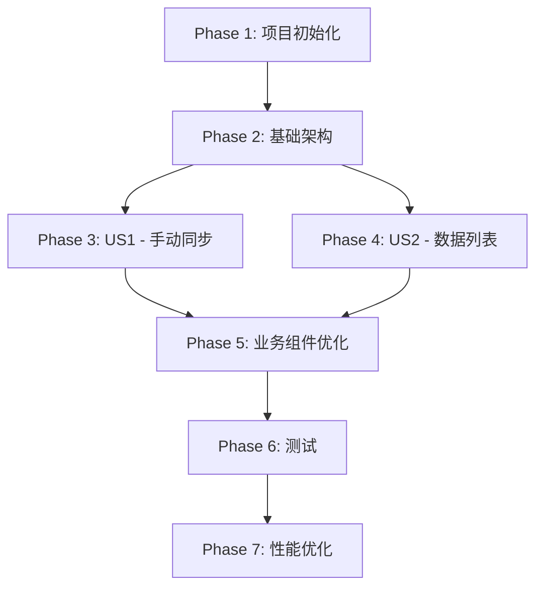

# 任务列表：绩效数据同步功能

**特性名称:** 绩效数据同步功能前端实现  
**版本:** 1.0  
**日期:** 2025-12-27

---

## 概述

本任务列表基于功能规范和实现计划生成，按用户故事组织，支持增量交付和独立测试。

**用户故事（User Stories）:**

- **US1**: 手动触发绩效数据同步 - 人力资源管理人员可以手动触发绩效数据的增量或全量同步
- **US2**: 查看绩效数据列表 - 管理员可以查看、搜索和筛选绩效数据列表

**MVP 范围:** US1 + US2（手动同步 + 绩效数据列表）

---

## Phase 1: 项目初始化与环境搭建

> **目标:** 完成绩效数据同步功能的基础设施配置

### 目录结构创建

- [x] T001 创建 src/views/performance 目录（绩效数据页面）

---

## Phase 2: 基础架构（Foundation）

> **目标:** 搭建绩效数据同步功能的基础设施，为所有用户故事提供支撑
>
> **完成标准:**
>
> - ✅ TypeScript 类型定义完整
> - ✅ API 接口定义完成
> - ✅ 数据转换函数实现

### TypeScript 类型定义

- [x] T002 [P] 创建 src/types/performance.ts 定义绩效数据相关类型（PerformanceReport, PerformanceReportQueryParams, PerformanceReportFilters, PerformanceSyncRequest, PerformanceSyncResponse）
- [x] T003 在 src/types/index.ts 中导出绩效数据相关类型

### API 接口定义

- [x] T004 在 src/api/index.ts 中实现 getPerformanceReports() 方法（调用 GET /api/v1/performance-reports）
- [x] T005 在 src/api/index.ts 中实现 triggerPerformanceSync() 方法（调用 POST /api/v1/sync/performance-reports）

### 数据转换函数

- [x] T006 [P] 在 src/utils/transform.ts 中添加 transformPerformanceReport() 函数（snake_case 转 camelCase）
- [x] T007 [P] 在 src/utils/transform.ts 中添加 transformPerformanceQueryParams() 函数（camelCase 转 snake_case）

---

## Phase 3: US1 - 手动触发绩效数据同步

> **用户故事:** 作为人力资源管理人员，我想要手动触发绩效数据同步，以便在需要时立即获取最新的绩效数据
>
> **验收标准:**
>
> - ✅ 可以选择同步类型（增量同步或全量同步）
> - ✅ 可以选择要同步的数据源（可选）
> - ✅ 可以指定时间范围（可选）
> - ✅ 触发同步后系统显示同步进度
> - ✅ 同步完成后显示结果摘要
> - ✅ 同步失败时显示明确的错误提示
>
> **独立测试:** E2E 测试手动同步触发流程

### Performance Store 实现

- [x] T008 [US1] 创建 src/stores/performance.ts Performance Store 骨架（state, getters, actions）
- [x] T009 [US1] 实现 Performance Store state（reports, total, loading, filters, currentPage, pageSize, syncing, syncProgress, lastSyncTime, syncStatus, syncError, currentBatchId）
- [x] T010 [US1] 实现 Performance Store getter totalPages
- [x] T011 [US1] 实现 Performance Store getter hasReports
- [x] T012 [US1] 实现 Performance Store getter canSync
- [x] T013 [US1] 实现 Performance Store action triggerSync()（调用 API，更新同步状态）
- [x] T014 [US1] 实现 Performance Store action checkSyncStatus()（轮询检查同步状态）
- [x] T015 [US1] 在 triggerSync() 中处理同步成功/失败状态
- [x] T016 [US1] 在 triggerSync() 中实现同步状态轮询逻辑

### 同步触发组件

- [x] T017 [US1] 创建 src/components/performance/PerformanceSyncTrigger.vue 同步触发组件骨架
- [x] T018 [US1] 在 PerformanceSyncTrigger.vue 实现对话框（el-dialog）
- [x] T019 [US1] 在 PerformanceSyncTrigger.vue 实现同步类型选择（el-radio-group: incremental/full）
- [x] T020 [US1] 在 PerformanceSyncTrigger.vue 实现数据源选择（el-select，可选）
- [x] T021 [US1] 在 PerformanceSyncTrigger.vue 实现时间范围选择（el-date-picker，可选）
- [x] T022 [US1] 在 PerformanceSyncTrigger.vue 实现确认按钮点击事件
- [x] T023 [US1] 在 PerformanceSyncTrigger.vue 调用 Performance Store triggerSync() 方法
- [x] T024 [US1] 在 PerformanceSyncTrigger.vue 显示同步进度和状态
- [x] T025 [US1] 在 PerformanceSyncTrigger.vue 处理同步成功/失败提示（ElMessage）

---

## Phase 4: US2 - 查看绩效数据列表

> **用户故事:** 作为管理员，我想要查看、搜索和筛选绩效数据列表，以便了解绩效数据情况
>
> **验收标准:**
>
> - ✅ 绩效数据列表正常加载并分页显示
> - ✅ 支持按年份筛选
> - ✅ 支持按季度筛选
> - ✅ 支持按员工姓名搜索
> - ✅ 支持按员工用户ID搜索
> - ✅ 支持按组织路径ID筛选
> - ✅ 支持按绩效评级筛选
> - ✅ 分页功能正常工作
> - ✅ 加载状态显示（loading）
>
> **独立测试:** E2E 测试绩效数据列表查询和筛选流程

### Performance Store 扩展

- [x] T026 [US2] 实现 Performance Store action fetchReports()（调用 API 获取绩效数据列表）
- [x] T027 [US2] 实现 Performance Store action updateFilters()（更新筛选条件）
- [x] T028 [US2] 实现 Performance Store action resetFilters()（重置筛选条件）
- [x] T029 [US2] 实现 Performance Store action updatePagination()（更新分页信息）

### 绩效数据列表页面

- [x] T030 [US2] 创建 src/views/performance/PerformanceReportListPage.vue 页面骨架
- [x] T031 [US2] 在 PerformanceReportListPage.vue 实现页面头部（PageHeader 组件，标题 + 同步按钮）
- [x] T032 [US2] 在 PerformanceReportListPage.vue 实现筛选区域（FilterPanel 组件）
- [x] T033 [US2] 在 PerformanceReportListPage.vue 实现年份筛选（el-input-number）
- [x] T034 [US2] 在 PerformanceReportListPage.vue 实现季度筛选（el-select: Q1/Q2/Q3/Q4）
- [x] T035 [US2] 在 PerformanceReportListPage.vue 实现员工姓名搜索（el-input）
- [x] T036 [US2] 在 PerformanceReportListPage.vue 实现员工用户ID搜索（el-input）
- [x] T037 [US2] 在 PerformanceReportListPage.vue 实现组织路径ID筛选（el-input）
- [x] T038 [US2] 在 PerformanceReportListPage.vue 实现绩效评级筛选（el-select）
- [x] T039 [US2] 在 PerformanceReportListPage.vue 实现搜索和重置按钮
- [x] T040 [US2] 在 PerformanceReportListPage.vue 实现绩效数据表格（el-table，显示所有字段）
- [x] T041 [US2] 在 PerformanceReportListPage.vue 实现分页组件（el-pagination）
- [x] T042 [US2] 在 PerformanceReportListPage.vue onMounted 时调用 fetchReports()
- [x] T043 [US2] 在 PerformanceReportListPage.vue 实现搜索按钮点击事件
- [x] T044 [US2] 在 PerformanceReportListPage.vue 实现重置按钮点击事件
- [x] T045 [US2] 在 PerformanceReportListPage.vue 实现分页切换事件
- [x] T046 [US2] 在 PerformanceReportListPage.vue 添加 loading 状态显示
- [x] T047 [US2] 在 PerformanceReportListPage.vue 集成 PerformanceSyncTrigger 组件

### 路由配置

- [x] T048 [US2] 在 src/router/routes.ts 中添加绩效数据路由（/performance/reports）

---

## Phase 5: 业务组件与样式优化

> **目标:** 优化绩效数据列表页面样式和用户体验

### 样式优化

- [x] T049 优化绩效数据表格样式（列宽、对齐、溢出处理）
- [x] T050 优化筛选面板样式（间距、对齐）
- [x] T051 优化同步触发对话框样式

---

## Phase 6: 测试与质量保证

> **目标:** 确保代码质量和功能正确性

### 单元测试

- [x] T052 编写 tests/stores/performance.test.ts 测试 Performance Store（fetchReports, triggerSync, updateFilters）
- [x] T053 编写 tests/utils/transform.test.ts 测试绩效数据转换函数

### E2E 测试

- [x] T054 编写 tests/e2e/performance-sync.spec.ts 测试手动同步触发流程
- [x] T055 编写 tests/e2e/performance-list.spec.ts 测试绩效数据列表查询和筛选流程

### 代码质量检查

- [x] T056 运行 oxlint 修复代码风格问题
- [ ] T057 运行 vue-tsc 修复类型错误
- [x] T058 运行 oxfmt 格式化代码
- [ ] T059 检查测试覆盖率（stores: 80%+, utils: 100%）

---

## Phase 7: 性能优化与 Sentry 集成

> **目标:** 优化应用性能，集成错误监控

### 性能优化

- [x] T060 实现搜索输入框防抖处理（避免频繁请求）
- [x] T061 优化筛选条件变更时的请求频率（防抖）

### Sentry 集成

- [x] T062 在 Performance Store 中集成 Sentry 错误上报（fetchReports, triggerSync）
- [x] T063 在 PerformanceReportListPage.vue 中集成 Sentry 错误边界

---

## 依赖关系图



**关键依赖说明：**

- **Phase 2（基础架构）** 必须在所有用户故事之前完成（阻塞依赖）
- **US1 和 US2** 可以并行开发（独立用户故事）
- **Phase 5（业务组件）** 依赖所有用户故事页面完成
- **Phase 6、Phase 7** 按顺序执行

---

## 并行执行机会

### 并行组 1：基础架构（Phase 2）

可并行执行任务：T002, T006, T007（类型定义和数据转换可同时创建）

```bash
# 开发者 A
T002, T003

# 开发者 B
T006, T007
```

### 并行组 2：用户故事实现（Phase 3-4）

US1 和 US2 可以由不同开发者并行开发：

```bash
# 开发者 A: US1 手动同步
T008-T025

# 开发者 B: US2 数据列表
T026-T048
```

---

## 实施策略

### MVP 交付（最小可行产品）

**包含：** Phase 1-4（项目初始化 + 基础架构 + US1 + US2）

**交付物：**

- ✅ 用户可以手动触发绩效数据同步
- ✅ 用户可以查看绩效数据列表
- ✅ 用户可以筛选和搜索绩效数据
- ✅ 用户可以查看同步状态

**预计时间：** 3-4 天

### 最终交付（优化和测试）

**包含：** Phase 5-7

**交付物：**

- ✅ 所有业务组件完成
- ✅ 所有测试通过
- ✅ 性能优化完成
- ✅ Sentry 集成完成

**预计时间：** 2-3 天

---

## 任务统计

**总任务数:** 63

**按阶段统计:**

- Phase 1（项目初始化）: 1 个任务
- Phase 2（基础架构）: 6 个任务
- Phase 3（US1 手动同步）: 18 个任务
- Phase 4（US2 数据列表）: 23 个任务
- Phase 5（业务组件）: 3 个任务
- Phase 6（测试）: 8 个任务
- Phase 7（优化）: 4 个任务

**并行任务数:** 5 个（标记 [P]）

**用户故事分布:**

- US1: 18 个任务
- US2: 23 个任务

---

## 验收标准

### Phase 2（基础架构）验收

```bash
# 验证类型定义
1. 检查 src/types/performance.ts 类型定义完整
2. 运行 vue-tsc 验证类型正确性

# 验证 API 接口
1. 检查 src/api/index.ts 接口方法实现
2. 验证请求参数和响应类型
```

### US1（手动同步）验收

```bash
# E2E 测试
1. 访问绩效数据列表页
2. 点击"同步数据"按钮
3. 选择同步类型（增量/全量）
4. 确认触发同步
5. 验证同步状态显示
6. 验证同步完成后提示
```

### US2（数据列表）验收

```bash
# E2E 测试
1. 访问 /performance/reports
2. 验证绩效数据列表加载
3. 输入年份筛选条件
4. 输入季度筛选条件
5. 输入员工姓名搜索
6. 点击搜索按钮
7. 验证搜索结果
8. 点击分页
9. 验证页码切换
```

---

## 注意事项

### 开发规范

1. **命名规范**
   - 组件文件：PascalCase（PerformanceReportListPage.vue）
   - Store 文件：camelCase（performance.ts）
   - 类型文件：camelCase（performance.ts）

2. **代码风格**
   - 使用 `<script setup lang="ts">` 语法
   - 所有类型必须显式定义（TypeScript Strict Mode）
   - 使用 Composition API

3. **提交规范**
   - 遵循 Conventional Commits 规范
   - 每个任务一次提交
   - 提交信息格式：`feat(US1): implement performance sync trigger`

### 测试规范

1. **单元测试**
   - Store 测试覆盖率 80%+
   - 工具函数测试覆盖率 100%
   - 使用 vitest 编写测试

2. **E2E 测试**
   - 覆盖所有用户故事的主流程
   - 使用 Playwright

### 质量门禁

- ✅ oxlint 零错误
- ✅ vue-tsc 零错误
- ✅ 测试覆盖率达标
- ✅ 所有测试通过

---

## 快速开始

```bash
# 1. 创建目录结构
mkdir -p src/views/performance

# 2. 执行 Phase 2 任务
# 创建类型定义和 API 接口

# 3. 启动开发服务器
pnpm dev

# 4. 运行测试
pnpm test

# 5. 构建生产版本
pnpm build
```

---

**任务列表生成完毕！准备开始实施！** 🚀
